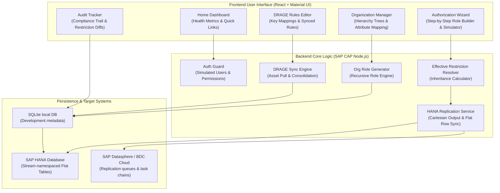

# End-User Operations Manual: SAP BDC Authorization Wizard

Welcome to the **SAP BDC Authorization Wizard** operations manual. This guide is designed to help business administrators, security managers, and compliance officers navigate the application to manage role-based row-level permissions, build organizational access configurations, and synchronize security rules with SAP HANA and SAP Datasphere.

---

## Table of Contents
1. [Introduction & Business Purpose](#1-introduction--business-purpose)
2. [Prerequisites & System Preparation](#2-prerequisites--system-preparation)
3. [Dashboard & Health Center](#3-dashboard--health-center)
4. [Organizational Hierarchy Management](#4-organizational-hierarchy-management)
5. [The Authorization Wizard (Creating & Editing Roles)](#5-the-authorization-wizard-creating--editing-roles)
6. [Assigning Roles to Users](#6-assigning-roles-to-users)
7. [Compliance & Audit Logs](#7-compliance--audit-logs)
8. [System Administration & Configurations](#8-system-administration--configurations)
9. [Decentralized Self-Service & Role Inheritance](#9-decentralized-self-service--role-inheritance)
10. [Classification Streams & Namespaced Database Tables](#10-classification-streams--namespaced-database-tables)
11. [Troubleshooting & Common Questions](#11-troubleshooting--common-questions)

---

## 1. Introduction & Business Purpose

Access control in SAP HANA and SAP Datasphere requires precise, row-level restrictions to ensure that users can only view data relevant to their specific business domains (e.g., specific plants, countries, or customer segments). In large organizations, managing these permissions manually inside databases is slow, error-prone, and difficult to audit.

The **SAP BDC Authorization Wizard** solves this business challenge by:
* **Visualizing Organizational Hierarchies**: Allowing administrators to model business trees (e.g., Global $\rightarrow$ Region $\rightarrow$ Plant) and auto-generate corresponding security roles.
* **Simplifying Role Inheritance**: Supporting parent-child role structures where child roles automatically inherit restrictions from parent roles, reducing manual configuration.
* **Providing a Guided Workflow**: Stepping users through role creation, restriction building, testing/simulating access rules, and acquiring approval.
* **Automating Database Replication**: Expanding nested rules into flat rows (via Cartesian calculations) and pushing them to target SAP HANA database tables and Datasphere environments.

### System Architecture & Module Overview

---

## 2. Prerequisites & System Preparation

Before you begin, ensure you have the following ready:
1. **User Identity**: Your simulated or corporate user ID must be loaded. If you are an administrator, you will see a user switcher in the top bar to test profiles.
2. **Access Permissions**: Your user account must have the appropriate permission flags enabled (e.g., `canManageSingleRoles` to create standalone roles, `canAssignRoles` to link roles to users, or `isSuperAdmin` to access the administration settings).
3. **Target Environments**: Check that your deployment environments (e.g., Development, Quality Assurance, Production) are configured.

---

## 3. Dashboard & Health Center

The **Home Dashboard** acts as a control center. It highlights the health of your authorization landscape and details where attention is needed.

### Key Metrics Tracked
* **Roles Health Overview**: Monitor your total count of security roles, and view flags for roles with issues:
  * **Critical**: High-risk roles that grant sensitive access.
  * **Unrestricted**: Roles that do not have restrictions defined, meaning they may expose excessive data.
  * **No Users**: Active roles that have not been assigned to anyone.
  * **No Approver**: Roles that lack designated owners or approvers.
* **Users & Assignments**: Track total unique users and total active role assignments across all environments.
* **Organizational Nodes**: View the count of nodes configured in your corporate tree, grouped by classification.
* **Recently Created Roles**: Access quick links to review or edit roles that were recently registered.

---

## 4. Organizational Hierarchy Management

The **Organization** view allows you to model your business structure. The application reads this tree to auto-generate corresponding security roles based on attributes mapped to each node.

### How to Add a Node to the Hierarchy
1. Click **Organization** in the sidebar.
2. If you are starting fresh, click the **Add Node** button in the top-right corner to create a root node.
3. In the form card:
   * In the first text box, enter the **Node Name** (e.g., `North America`).
   * Select a **Type** from the drop-down list (e.g., `Region`, `Country`, `Plant`).
   * Click **Add**.
4. To add sub-units under an existing node, locate that node in the list and click the **Add Child Node** icon (indicated by a small building symbol on the right side of the row).
5. Input the name and type in the slide-down pane and click **Add**.

### Mapping Key-Value Attributes to a Node
Attributes determine what actual data filters are bundled when roles are generated from a node.
1. Locate the target node and click the **Add Attribute** icon (indicated by a **+** symbol on the right).
2. In the input boxes:
   * Enter the **Field** name (e.g., `Country`).
   * Enter the matching **Value** (e.g., `US`).
3. Click **Add**. The attribute will appear as a blue tag next to the node name.

### Moving or Re-Organizing Nodes
1. Click the **Move Node** icon (indicated by a right-facing arrow) on the node you wish to move.
2. In the dialog, click the **New Parent Node** drop-down.
3. Select the new parent node from the list, or choose the blank option to make it a top-level root node.
4. Click **Move**.

### Generating Authorization Roles from Nodes
* **Single Node**: Locate the node and click the **Role** button (with a bolt icon). The system will immediately create a role populated with the node's attributes.
* **All Nodes**: Click the **Generate All Roles** button at the top-right of the screen to sync the entire hierarchy in one action.

---

## 5. The Authorization Wizard (Creating & Editing Roles)

The **Authorization Wizard** is a four-step guided flow for building and editing roles.

### Step 1: Origin & Parent Definition
1. Open the wizard by clicking **Create Role** on the **Roles** tab, or **Create Role Wizard** on the dashboard.
2. Select the **Role Type**:
   * **Single Role**: A standalone role configured from scratch.
   * **Organizational-Based**: A role linked directly to an organizational node.
3. If creating a **Single Role**, you may optionally choose **Parent Roles** from the drop-down list. If selected, the new role becomes a "Derived Role" and automatically inherits all parent restrictions.
4. Enter the **Role Name** (e.g., `ROLE_FINANCE_US`) and a **Description**.
5. Select the **Environment** (e.g., `D` for Development) and the classification **Stream** (e.g., `finance`).
6. If the role is highly sensitive, toggle the **Critical Role** checkbox.
7. Click **Next** in the bottom-right corner.

### Step 2: Configuring Restrictions & Simulating Access
Restrictions restrict data views. You can define various filter types:

1. Click **Add Restriction**.
2. Select a **Restriction Field** (e.g., `Plant` or `Company Code`).
3. Select the **Filter Type**:
   * **Single Value**: Restricts access to a single entry. Enter the exact term (e.g., `DE01`) in the value input.
   * **Multiple Values**: Restricts access to several specific entries. Add multiple values in the list.
   * **Range / Between**: Restricts access to a continuous range. Enter a **From** value and a **To** value.
   * **Hierarchy Node**: Selects a parent category that includes all its sub-elements in the data system.
   * **Wildcard Pattern**: Restricts access using symbols (e.g., `CC%` matches all codes starting with CC).
4. Review the **Inherited Restrictions** section to see filters automatically provided by parent roles.
5. **Simulate Access (Testing)**:
   * To verify your filters work correctly before deploying, scroll to the **Simulate Effective Restrictions** panel.
   * Enter test rows in JSON format in the input field, representing data records users might attempt to view.
   * Click **Run Access Simulation**.
   * Review the output: Green indicates the rows are allowed; Red indicates they are blocked.
6. Click **Next**.

### Step 3: Declaring Approvers
1. Search for users who must authorize changes to this role using the **Search Approver (SCIM)** lookup.
2. Start typing a name or email (at least 3 characters). The list will search the user directory.
3. Select the correct user, then click the **Add** button.
4. Repeat for any additional required approvers.
5. Click **Next**.

### Step 4: Review & Deploy
1. Review the details summarized on the screen.
2. Click **Deploy Role**.
3. **Downstream Impact Warning**:
   * If you are editing an existing parent role that has child roles (derived roles) or active users, a warning dialog will appear.
   * Review the list of affected child roles and users.
   * Click **Confirm** to accept the changes. The system will deploy the changes and update all down-stream permissions in the background.

---

## 6. Assigning Roles to Users

Once roles are deployed, you must assign them to users or groups to grant them access.

### Step-by-Step Assignment Workflow
1. Click **Role Assignments** in the sidebar.
2. Click **Assign Role** to slide open the creation panel.
3. In the **Search User (SCIM)** lookup, type a user's name or email (minimum 3 characters) and select them from the list.
4. In the **Role** drop-down, select the role you want to assign. 
   > [!NOTE]
   > Roles that contain no restrictions cannot be assigned. They will appear disabled in the list.
5. Click **Assign**. The user will appear in the assignments table.

### Filtering and Finding Assignments
Use the filter toolbar at the top of the table to locate assignments:
* Search by **User ID** or **User Name**.
* Filter by **Role** names.
* Define a date range using the **Assigned On: Start** and **Assigned On: End** calendar pickers.
* Filter by the administrator who made the assignment in the **Assigned By** box.
* Click **Reset** to clear all active filters.

### Removing an Assignment
1. Locate the assignment in the table.
2. Click the red **Trash Can** icon on the right side of the row.
3. In the confirmation dialog, click **Confirm**. This immediately deletes the assignment and triggers a background update to remove their database access.

---

## 7. Compliance & Audit Logs

The system maintains an append-only audit trail of adjustments made to roles, restrictions, and user assignments.

### Searching and Filtering Audits
1. Click **Audit Logs** in the sidebar.
2. Apply filters in the toolbar:
   * **Search Box**: Search for specific record IDs, users, or change details.
   * **Time Range**: Select preset ranges (e.g., `Today`, `Past 7 Days`) or choose `Custom Range` to specify start and end dates.
   * **Action**: Filter by `CREATE`, `UPDATE`, or `DELETE`.
   * **Entity Type**: Filter by `Roles` or `Role Assignments`.
   * **Performed By**: Select the administrator who carried out the changes.
   * **Critical Roles Only**: Check this to isolate audits related to high-risk roles.

### Reviewing Change Details
1. Locate the target log entry in the table.
2. Click the **Eye** icon on the right side of the row to open the **Audit Details** dialog.
3. Review the summary:
   * **General Information**: Details property changes like description or environment adjustments.
   * **Restriction changes**: Displays a table showcasing exactly which fields were **Added**, **Deleted**, or **Changed**, along with old and new values.
4. Click **Close** when finished.

---

## 8. System Settings & Administration

Administrators configure connections, global parameters, and permissions from the **System Administration** tab.

### Configuring BDC Connections (SAP Datasphere / SAP HANA)
1. Click **Administration** and open the **BDC Connections** tab.
2. Click **Add Connection** to open the form.
3. Set the **Connection Type**:
   * For **OData**: Input the **System Connection Name**, target **Environment**, **Basis URL**, **Token URL**, **Client ID**, and **Client Secret**.
   * For **SAP Hana**: Input the **Hostname**, **Port**, database **User**, and **Password**.
4. For OData connections, click **Fetch Spaces** to load catalog spaces, then select the target **Space** from the drop-down.
5. Provide the target **Task Chain** IDs used to refresh database authorization tables.
6. Click **Save Connection**.
7. Locate the saved connection and click **Test Connection** to verify connection health.

### Managing Restriction Fields
1. Go to the **Restriction Fields** tab.
2. Define the security dimensions available in the wizard (e.g., `Plant`, `Customer ID`).
3. Link them to BDC connection URLs and asset paths to enable value lookups during restriction building.
   * > [!IMPORTANT]
     > **Reusing Predefined BDC Views**: Instead of building and maintaining custom security views or dedicated lookup tables, you can link restriction fields directly to the **exact same predefined views/assets** used for general data modeling in SAP BDC. This eliminates database object duplication and ensures restriction lookups are always in sync with your master data models.

### Dynamic Generation Rules (DRAGE Engine)
The Dynamic Role & Assignment Generation Engine (DRAGE) auto-generates roles and assignments based on external master data (e.g., customer ownership tables).
1. Go to the **Dynamic Rules** tab.
2. Click **New Rule** and fill out the code, description, and target stream.
3. Map the source fields from your integration database to the target restriction fields in the mapping grid.
4. Choose the **Generation Mode**:
   * **User Consolidated Role**: Merges filters into a single role for each user.
   * **Static Template Role Assignment**: Assigns a template role to users matching the criteria.
5. Click **Save Rule**.
6. Click the **Play** button on any active rule to trigger synchronization.

---

## 9. Decentralized Self-Service & Role Inheritance

In enterprise security modeling, managing role-based row-level filters can easily create a bottleneck if every new regional plant, department, or customer segment requires a Central IT security team to construct new roles. 

The **SAP BDC Authorization Wizard** solves this by separating roles into two distinct structures:
1. **Parent (Single) Roles**: Global, high-level structural templates managed exclusively by Central IT Security. They define the structural logic (e.g., "All financial roles must restrict by Company Code").
2. **Derived (Child) Roles**: Regional, low-level operational roles managed by localized Business Administrators. They inherit all parent structural configurations and add local parameter constraints (e.g., "Company Code = FR01").

This separation allows for a highly secure **Decentralized Self-Service** model:
* **Central Control**: Central IT is the only group with the `canManageSingleRoles` permission. They define the global boundaries and approved fields.
* **Local Autonomy**: Local Business Admins are given only the `canManageDerivedRoles` permission. They cannot alter global templates, but they can autonomously create sub-roles and assign them to local employees.

### How a Local Administrator Creates a Derived Role
1. Click the **Roles** tab or click the **Create Role Wizard** link from the dashboard.
2. In **Step 1 (Origin)**:
   * Select **Single Role** as the Role Type.
   * Under the **Parent Roles** multi-select field, select the IT-approved template role (e.g., `TEMPLATE_FINANCE`).
   * Enter a localized **Role Name** (e.g., `ROLE_FIN_FRANCE`) and a description.
   * Select the appropriate **Environment** and **Stream**.
3. Click **Next** to move to **Step 2 (Restrictions)**:
   * Notice that the **Inherited Restrictions** section is pre-populated with filters from the parent template. These are read-only and cannot be removed or weakened.
   * Click **Add Restriction** to configure local boundaries (e.g., adding `Company Code` set to `FR01`).
4. Click **Next**, define the localized approvers in **Step 3**, and click **Deploy Role** in **Step 4**.
5. Once deployed, the local admin can immediately assign this derived role to their team members on the **Role Assignments** page.

---

## 10. Classification Streams & Namespaced Database Tables

To prevent performance degradation when querying millions of row-level data restrictions, the system avoids storing all permissions in a single, massive database table. Instead, it segments authorization rules using **Classification Streams**.

### What is a Stream?
A **Stream** is a hierarchical category or domain (e.g., `Finance`, `Sales`, `HR`) used to classify security roles. It acts as both a folder system for grouping your roles and as a namespacing tool for your database.

### Why are Streams Needed? (Core Benefits)
1. **Isolated Database Performance (Namespaced Tables)**:
   * Every time you create a new Stream node in the wizard, the backend automatically issues a command (`DDL`) to create a dedicated flat table inside your target SAP HANA connections.
   * This table is dynamically named: `[stream_name]_flat_authorizations` (e.g., `finance_flat_authorizations`).
   * When user assignments are synchronized, row-level filters are calculated and written *only* to the relevant stream table. This keeps tables small, index-friendly, and blazing fast for external queries.
2. **Simplified Role Organization**:
   * Storing roles under specific streams prevents global role sprawl. Administrators can filter dashboard metrics, list views, and rules by a specific business domain.
3. **Targeted Data Push (Datasphere Sync)**:
   * When data is replicated to SAP Datasphere, the task chains only push the relevant stream's data rows rather than running a full bulk sync of the entire enterprise database, minimizing data transmission times.
4. **Context-Based Authorization Splitting (Same Field, Different Access Scopes)**:
   * A single user often needs different access boundaries for the **same restriction field** depending on the business application context (e.g. Sales Reporting vs Sales Planning).
   * For example, in **Sales Reporting**, a regional manager might be allowed to view reporting data for all sales organizations. But in **Sales Planning**, the same manager should only plan figures for their own specific local sales organization.
   * By setting up two distinct streams—`sales-reporting` and `sales-planning`—the administrator can assign two separate roles to the same user. The reporting role (in the reporting stream table) contains all sales organizations, while the planning role (in the planning stream table) contains only their local sales organization. This prevents authorization collision and keeps application permissions completely separated.

### How to Create and View Streams
1. Navigate to the **Streams** page from the sidebar menu.
2. Click **Add Node** to define a new classification tree node.
3. Once the stream is created, the system immediately initializes the flat table `[stream_name]_flat_authorizations` on all active database connections.

---

## 11. Troubleshooting & Common Questions

Here is how to handle common errors and system messages:

#### "A role with name [...] already exists"
* **Why it happens**: Role names must be unique. The name you typed is already registered in the system.
* **How to fix**: Modify the name in Step 1 of the wizard by adding a unique suffix (e.g., `_US_WEST` instead of `_US`).

#### "Cannot delete [...] — it still has child nodes. Remove all children first."
* **Why it happens**: You attempted to delete an organizational category that has sub-categories under it.
* **How to fix**: Navigate to the sub-categories, delete or move them first, and then delete the parent node.

#### "No key columns found in metadata for selected asset"
* **Why it happens**: The application could not read database keys from the selected BDC asset.
* **How to fix**: Verify that the selected asset is a valid table or view in SAP Datasphere, and check that your BDC connection credentials are correct.

#### HANA Replication or Space Lookup Fails
* **Why it happens**: Network issues or invalid login credentials for the target cloud space.
* **How to fix**: Navigate to **Administration** $\rightarrow$ **BDC Connections**, locate the connection, click edit, verify the credentials, and click **Test Connection** to identify the source of the failure.
